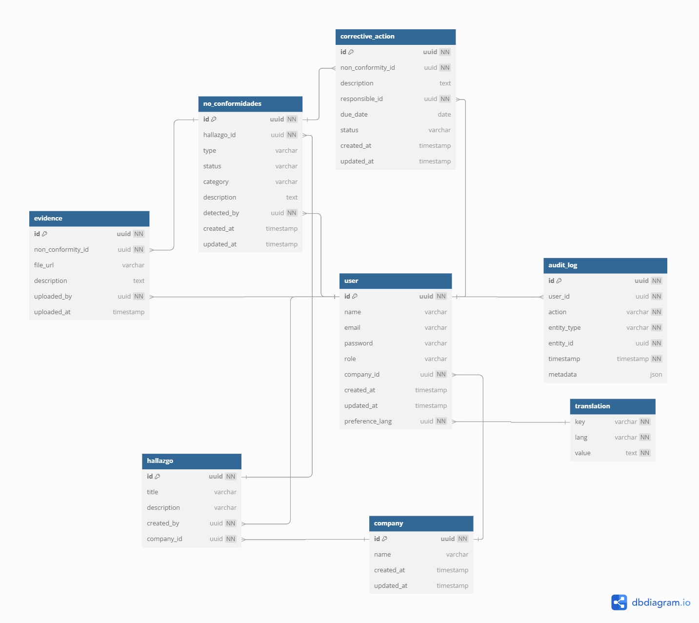

# ISOQMS
Plataforma Web para la Gestión de Hallazgos y No Conformidades según ISO 9001:2015

## 🚀 Tecnologías
- [X] ~~React + Next.js~~
- [ ] TailwindCSS + shadcn/ui
- [ ] Node.js + Express
- [ ] PostgreSQL + Prisma
- [ ] Zod o Joi para validaciones
- [ ] JWT + bcrypt para autenticación
- [ ] Swagger para documentación
- [ ] i18n (multiidioma)
- [ ] Logs de auditoría

---

## Backend
### Estructura
- [ ] Inicializar proyecto con Express + Prisma
- [ ] Configurar conexión a PostgreSQL
- [ ] Crear modelos de base de datos
- [ ] Generar migraciones

### Documentacion
### Diagrama E/R
> 
### Diccionario de Datos
> ### User
>| Campo            | Tipo       | Requerido | Clave | Descripción                            |
>|------------------|------------|-----------|-------|----------------------------------------|
>| id               | INT     | si        | PK    | Identificador único del usuario        |
>| name             | VARCHAR    | si        |       | Nombre completo                        |
>| email            | VARCHAR    |si         | ÚNICO | Correo electrónico                     |
>| password         | VARCHAR    | si         |       | Contraseña cifrada                     |
>| role             | VARCHAR    | si         |       | Rol dentro del sistema                 |
>| company_id       | INT      | si         | FK    | Relación con la empresa                |
>| created_at       | TIMESTAMP  | si        |       | Fecha de alta                          |
>| updated_at       | TIMESTAMP  | no         |       | Última modificación                    |
>| preference_lang  | INT      | no         | FK    | Idioma preferido del usuario           |
> ### Company
> | Campo       | Tipo      | Requerido | Clave | Descripción              |
>| ----------- | --------- | --------- | ----- | ------------------------ |
>| id          | UUID      | si        | PK    | Identificador de empresa |
>| name        | VARCHAR   | si        |       | Nombre de la empresa     |
>| created\_at | TIMESTAMP | si        |       | Fecha de creación        |
>| updated\_at | TIMESTAMP | no        |       | Fecha de modificación    |
> ### Hallazgo
> | Campo       | Tipo    | Requerido | Clave | Descripción                 |
>| ----------- | ------- | --------- | ----- | --------------------------- |
>| id          | UUID    | Sí        | PK    | Identificador del hallazgo  |
>| title       | VARCHAR | Sí        |       | Título corto del hallazgo   |
>| description | VARCHAR | Sí        |       | Descripción detallada       |
>| created\_by | UUID    | Sí        | FK    | Usuario que lo registró     |
>| company\_id | UUID    | Sí        | FK    | Empresa donde fue detectado |
> ### no conformidades
> | Campo        | Tipo      | Requerido | Clave | Descripción                           |
>| ------------ | --------- | --------- | ----- | ------------------------------------- |
>| id           | UUID      | Sí        | PK    | Identificador de la no conformidad    |
>| hallazgo\_id | UUID      | Sí        | FK    | Relación con el hallazgo              |
>| type         | VARCHAR   | Sí        |       | Tipo: menor, mayor, mejora, etc.      |
>| status       | VARCHAR   | Sí        |       | Estado actual                         |
>| category     | VARCHAR   | Sí        |       | Clasificación interna                 |
>| description  | TEXT      | Sí        |       | Descripción completa                  |
>| detected\_by | UUID      | Sí        | FK    | Usuario que detectó la no conformidad |
>| created\_at  | TIMESTAMP | Sí        |       | Fecha de detección                    |
>| updated\_at  | TIMESTAMP | No        |       | Última modificación                   |
> ### Acciones
> | Campo               | Tipo      | Requerido | Clave | Descripción                        |
>| ------------------- | --------- | --------- | ----- | ---------------------------------- |
>| id                  | UUID      | Sí        | PK    | ID de la acción correctiva         |
>| non\_conformity\_id | UUID      | Sí        | FK    | Relación con no conformidad        |
>| description         | TEXT      | Sí        |       | Qué acción se va a realizar        |
>| responsible\_id     | UUID      | Sí        | FK    | Usuario responsable de ejecutarla  |
>| due\_date           | DATE      | Sí        |       | Fecha límite para ejecutarla       |
>| status              | VARCHAR   | Sí        |       | Estado: pendiente, ejecutada, etc. |
>| created\_at         | TIMESTAMP | Sí        |       | Fecha de creación                  |
>| updated\_at         | TIMESTAMP | No        |       | Última modificación                |
> ### Evidencia
> | Campo               | Tipo      | Requerido | Clave | Descripción                  |
>| ------------------- | --------- | --------- | ----- | ---------------------------- |
>| id                  | UUID      | Sí        | PK    | ID de la evidencia           |
>| non\_conformity\_id | UUID      | Sí        | FK    | No conformidad asociada      |
>| file\_url           | VARCHAR   | Sí        |       | Ruta o URL del archivo       |
>| description         | TEXT      | Sí        |       | Descripción del archivo      |
>| uploaded\_by        | UUID      | Sí        | FK    | Usuario que subió el archivo |
>| uploaded\_at        | TIMESTAMP | Sí        |       | Fecha de subida              |
> ### Registro de auditoría
> | Campo        | Tipo      | Requerido | Clave | Descripción                                |
>| ------------ | --------- | --------- | ----- | ------------------------------------------ |
>| id           | UUID      | Sí        | PK    | ID del registro                            |
>| user\_id     | UUID      | Sí        | FK    | Usuario que ejecutó la acción              |
>| action       | VARCHAR   | Sí        |       | Tipo de acción (crear, actualizar, borrar) |
>| entity\_type | VARCHAR   | Sí        |       | Entidad afectada                           |
>| entity\_id   | UUID      | Sí        |       | ID de la entidad                           |
>| timestamp    | TIMESTAMP | Sí        |       | Fecha de la acción                         |
>| metadata     | JSON      | No        |       | Datos adicionales relacionados             |
> ### Traduccion
> | Campo | Tipo    | Requerido | Clave | Descripción                       |
>| ----- | ------- | --------- | ----- | --------------------------------- |
>| key   | VARCHAR | Sí        | PK    | Clave de traducción               |
>| lang  | VARCHAR | Sí        | PK    | Código de idioma (ej: `es`, `en`) |
>| value | TEXT    | Sí        |       | Traducción correspondiente        |

